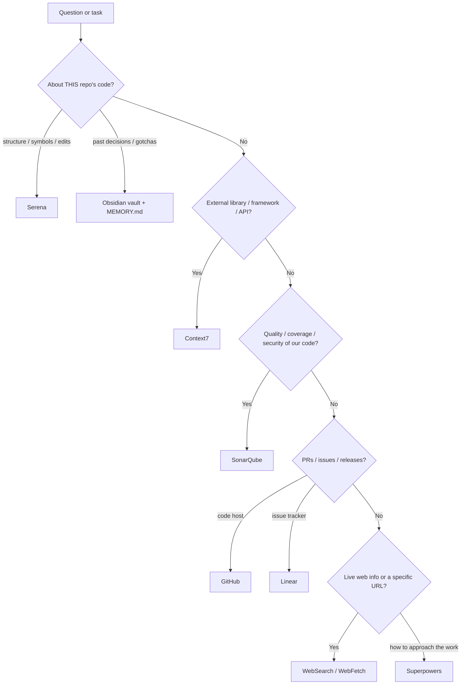

# AI Tooling Guide — smooth-operator

This project is built with the help of AI coding agents (Claude Code, GitHub Copilot, etc.) backed by a
set of purpose-built tools. This guide explains **what each tool is, when to use it, when not to, and how**,
so any contributor — human or agent — can keep building the app productively.

**Golden rule:** prefer a purpose-built tool over training-data recall or generic prompting. When unsure
whether a tool applies, invoke it — a no-op call is cheaper than a confidently wrong answer.

> **History:** ContextStream (memory/search) was **retired on 2026-06-17**; the canonical knowledge base
> is now the Obsidian vault (see [Project knowledge & memory](#project-knowledge--memory)). Do not call
> `init`/`context`/`search` ContextStream tools — they are no longer configured.

---

## Tool selection order

Use this as the default decision flow:

---

## Serena — semantic code navigation & editing

**What:** A language-server-backed MCP that understands the codebase by *symbol*, not text — definitions,
references, call sites, structure, and safe rename/replace. MCP prefix: `mcp__plugin_serena_serena__*`.

**When to use:**
- Finding where a symbol is defined or every place it's used (`find_symbol`, `find_referencing_symbols`).
- Getting an overview of a file/class before editing (`get_symbols_overview`).
- Surgical edits: replace a method body, insert before/after a symbol, rename across the project
  (`replace_symbol_body`, `insert_after_symbol`, `rename_symbol`).
- Any time structure matters more than raw text — prefer this over plain Grep for code questions.

**When NOT to use:** non-code text search, reading a known file top-to-bottom (just read it), or
external-library questions (use Context7).

**How:** Call `initial_instructions` first to load Serena's manual, then navigate symbol-first. It works
across the .NET solution (`backend/`) and the Angular app (`frontend/`).

---

## Context7 — library & framework documentation

**What:** Version-accurate, up-to-date docs for third-party libraries and frameworks, pulled on demand.
MCP prefix: `mcp__plugin_context7_context7__*`.

**When to use** — before guessing or trial-and-error, whenever you need real API signatures, config
options, or migration details for an external dependency: **.NET 10, EF Core, MediatR, Mapster, ASP.NET,
FluentValidation, Duende.IdentityModel, ITfoxtec SAML2, Angular 21, RxJS, Tailwind, guacamole-common-js,
Otp.NET, Fido2NetLib**, etc. *Use it even when you think you know the answer* — your training data may be stale.

**When NOT to use:** questions about this repo's own code (use Serena), refactors, business-logic
debugging, code review, or pure language constructs.

**How:**
1. `resolve-library-id(libraryName="<official name>", query="<what you need>")` — skip if you already have a `/org/project` ID.
2. `query-docs(libraryId="/org/project", query="<specific question>")`.
3. If results are thin, retry once with `researchMode: true`. Max ~3 calls per question.

Skill reference: `.github/skills/context7/SKILL.md`.

---

## Web search — WebSearch & WebFetch (general web, any URL)

**What:** General-purpose web access, distinct from Context7's curated library docs. These built-in tools
cover live/current information and arbitrary URLs.

- **WebSearch** — general web search; returns titles + URLs. Good for recent CVEs, GitHub issue threads,
  release notes, error messages, blog posts, community patterns, "as of <now>" questions.
- **WebFetch** — fetch a **specific URL**, convert to markdown, and answer a prompt against it. Use when
  you already have a link (docs page, changelog, advisory, Stack Overflow answer). Fails on
  authenticated/private URLs — use an authenticated MCP (GitHub, etc.) for those.

**When to use:** anything beyond the model's cutoff or outside library docs — security advisories,
dependency CVEs (qs/uuid/ws-style alerts), upstream Guacamole/Docker/CircleCI issues, or reading a page
the user linked.

**When NOT to use:** API/usage details for a known library (Context7 is more precise) or this repo's code (Serena).
Always **cite the source URL** when a web result drives the answer.

> **Optional — Tavily MCP:** Tavily (`tavily_search`, `tavily_extract`, `tavily_research`, `tavily_crawl`)
> was part of the earlier tool stack and is **not currently connected**. WebSearch/WebFetch cover the same
> needs. If you want Tavily's deep multi-source research or structured site crawl back, re-add it as an MCP
> server (`claude mcp add tavily …` with a Tavily API key) and prefer it for heavy research; otherwise the
> built-in tools are the default.

---

## SonarQube — code quality, coverage & security

**What:** Static analysis and quality-gate intelligence. This repo runs **SonarCloud** in CI
(project key `alessandrocaetanob_smooth-operator`) with an **80% new-code coverage** quality gate that
blocks PRs. Available as the `mcp__sonarqube__*` MCP **and** the `sonarqube:*` skills.

**When to use:**
- Before opening or merging a PR — check the gate status and new issues.
- Diagnosing why CI's Sonar step failed (coverage drop, new code smells, security hotspots, duplications).
- Finding low-coverage files and the exact uncovered lines to target tests.

**When NOT to use:** as a general linter for tiny local edits (use `dotnet format` / ESLint / Prettier),
or for logic bugs unrelated to quality metrics.

**How — MCP tools:**
- `get_project_quality_gate_status` — pass/fail + each condition.
- `search_sonar_issues_in_projects` — issues by project/branch/PR.
- `search_files_by_coverage` / `get_file_coverage_details` — coverage gaps and uncovered lines.
- `search_security_hotspots`, `get_duplications`, `get_component_measures`.

**How — skills:** `/sonarqube:sonar-quality-gate`, `sonar-coverage`, `sonar-list-issues`,
`sonar-fix-issue`, `sonar-duplication`, `sonar-dependency-risks`.

> Known tension: the 80% gate is fragile; high-effort frontend components (e.g. the recording player) are
> deliberately excluded rather than exhaustively unit-tested. New complex frontend code can re-trigger gate
> failures — check coverage early.

---

## GitHub — PRs, issues, releases, remote code

**What:** Interaction with the GitHub repo (`alessandrocaetanob/smooth-operator`). MCP prefix:
`mcp__plugin_github_github__*`; the `gh` CLI is also available for local git/PR operations.

**When to use:** open/read/update PRs and reviews, read/triage issues and Dependabot alerts, inspect
commits/branches/tags, cut or read releases, search code across the remote, request a Copilot review.

**When NOT to use:** local-only git work (use `git`/`gh` in the shell), or issue/project *planning* if you
track that in Linear.

**How — common tools:** `pull_request_read`, `list_pull_requests`, `create_pull_request`,
`pull_request_review_write`, `issue_read`, `issue_write`, `list_releases`, `get_latest_release`,
`search_code`, `search_issues`, `merge_pull_request`. Prefer `gh pr create` for opening PRs from a local branch.

> Repo workflow: branch from `master`, run Prettier (frontend) + `dotnet format` before committing, and
> remember commits on this machine need `git commit --no-gpg-sign` (1Password GPG agent). See `CLAUDE.md`.

---

## Linear — issue & project tracking

**What:** The issue tracker / project planning tool, when work is tracked there. MCP prefix:
`mcp__claude_ai_Linear__*`.

**When to use:** find or update issues, cycles, projects, and milestones; turn a discussion into a tracked
issue; check what's assigned or in the current cycle; attach a PR/diff to an issue.

**When NOT to use:** code-host operations (GitHub) or durable engineering knowledge (that lives in the
Obsidian vault, not Linear).

**How — common tools:** `list_issues`, `get_issue`, `save_issue` (create/update), `list_projects`,
`get_project`, `list_cycles`, `create_issue_label`, `save_comment`. Pass markdown content with real
newlines (no escaped `\n`).

---

## Superpowers — the workflow spine

**What:** A library of process skills that govern *how* to approach work, invoked via the Skill tool
(e.g. `superpowers:brainstorming`). They encode discipline that produces better results than ad-hoc prompting.

**When to use — match the skill to the moment:**
- `brainstorming` — **before** any new feature/behavior, to nail intent and design first.
- `writing-plans` / `executing-plans` — turn a spec into a step-by-step plan, then execute with checkpoints.
- `test-driven-development` — before writing implementation code for a feature or bugfix.
- `systematic-debugging` — at the first sign of a bug, test failure, or unexpected behavior (before guessing fixes).
- `requesting-code-review` / `receiving-code-review` — when finishing a chunk or before merging.
- `verification-before-completion` — before claiming something works; run the checks and show evidence.
- `using-git-worktrees`, `subagent-driven-development`, `dispatching-parallel-agents` — for isolated or parallel work.

**When NOT to use:** trivial one-line edits or purely conversational answers. Don't over-ceremony a typo fix.

**How:** invoke the relevant skill via the Skill tool before starting; if it has a checklist, follow it.
Process skills come first, implementation skills (below) second.

---

## frontend-design — distinctive Angular UI

**What:** A skill for intentional visual design when building or substantially restyling UI
(`Skill(frontend-design)`). The Angular SPA in `frontend/` is the usual target.

**When to use:** new pages/components or meaningful restyles where design quality matters (the project has a
standing preference to route UI work through this skill rather than ad-hoc styling).

**When NOT to use:** tiny tweaks (a single class change, copy edit, or bugfix).

---

## Project knowledge & memory

The **Obsidian vault** `H:\Obsidian\SmoothOperator` is the canonical, browsable knowledge base — plans,
design decisions, diagrams, gotchas, and lessons (start at `Home.md`). For AI agents, a slim native
`MEMORY.md` auto-loads each session and links into the vault.

- **Read** durable context from the vault before re-deriving it.
- **Save** new durable knowledge as a vault note (`Memory/`, `Plans/`, …) and add a one-line pointer to `MEMORY.md`.
- The repo's **`CLAUDE.md`** holds build/test commands, architecture, testing conventions, and Known Gotchas — read it first.

> This `.github/copilot-instructions.md` and the vault's `Reference/Tooling-Guide.md` are mirrors — keep
> them in sync when the toolset changes.
