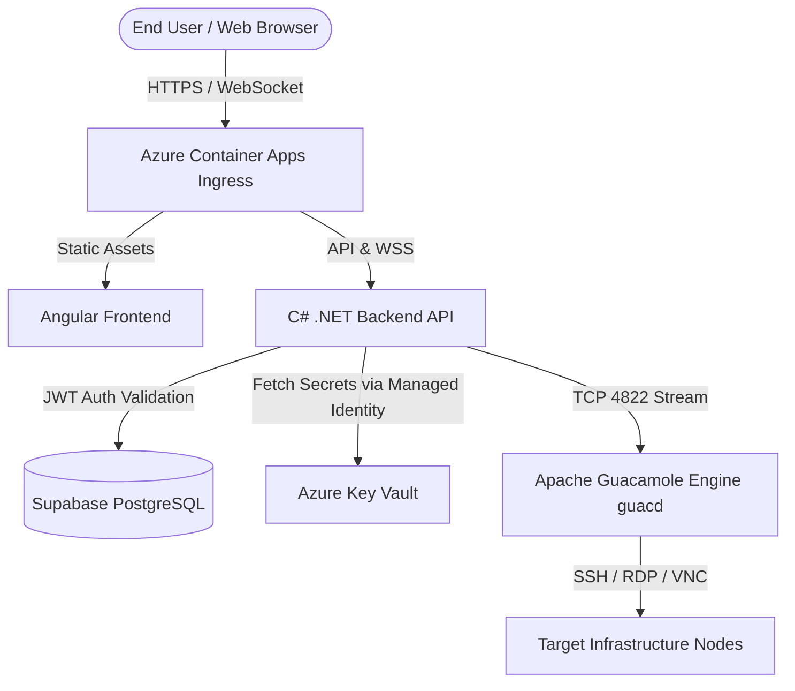

# Smooth Operator 🕶️ 🔐

**Smooth Operator** is a Cloud Native application acting as a centralized, clientless vault for managing remote connections (RDP, SSH, VNC). It provides infrastructure administrators and operators seamless and secure access to servers directly through the browser—eliminating the need for VPN clients or exposing ports to the public internet.

The application manages granular, team-based access permissions, ensuring end-users never have direct contact with actual server credentials.

---

## 🏗️ Architecture

The architecture is built upon a modern, decoupled Cloud Native stack.



### Component Breakdown

*   **Frontend:** Built with **Angular v17+** and **Tailwind CSS**. It employs modern "glassmorphism" styling and dark-mode aesthetics. The core connection streaming relies on the `guacamole-common-js` library rendering to an HTML5 `<canvas>`.
*   **Backend:** A **C# .NET 8/9 REST API**. Handles authentication verification, role/team authorization, and establishes the crucial WebSocket tunnels between the Angular frontend and the connection engine.
*   **Connection Engine:** An isolated **Apache Guacamole (`guacd`)** daemon written in C/C++. It translates generic remote desktop protocols (RDP, VNC, SSH) into a proprietary protocol that can be streamed over WebSockets.
*   **Database:** Persisted using **Supabase (PostgreSQL)**. Manages user identities, team structures, server configurations, and audit logging.
*   **Secrets Management:** **Azure Key Vault** stores connection strings, SSH private keys, and RDP passwords, accessed securely via Azure Managed Identities.
*   **Hosting:** Deployed to **Azure Container Apps (ACA)**.

---

## 🚀 Getting Started

### Prerequisites
*   [Docker Desktop](https://www.docker.com/products/docker-desktop/) or Docker Engine + Docker Compose
*   [Node.js v22+](https://nodejs.org/)
*   [.NET 8.0 SDK](https://dotnet.microsoft.com/en-us/download/dotnet/8.0)

### Running Locally with Docker Compose

The easiest way to run both the frontend and backend locally is via Docker Compose:

```bash
# From the project root directory
docker-compose up --build
```

This will:
1. Build the Angular frontend multi-stage image and serve it via Nginx on `http://localhost:4200`.
2. Build and run the .NET Web API on `http://localhost:5000`.

*(Note: `guacd` and Supabase instances are external dependencies or can be added to the docker-compose stack in later development phases).*

### Running Services Independently

#### Frontend (Angular)
```bash
cd frontend
npm install
npm start
# Available at http://localhost:4200
```

#### Backend (.NET)
```bash
cd backend
dotnet restore
dotnet run
# Available at http://localhost:5000
```

---

## 🎨 UX and Features

*   **Zero-Friction Auth:** Passwordless/SSO-first entry flow. The backend handles token claims and team membership logic transparently.
*   **Role-Based Vault Dashboards:** Admins can manage teams and register server instances, while Operators view an organized bento-grid dashboard of accessible servers without ever seeing the underlying credentials.
*   **Instant Browser Connections:** Initiating a connection opens a seamless HTML5 Canvas session using `guacamole-common-js`, immediately capturing input devices without local software.
*   **Comprehensive Audit Logs:** A robust auditing view allows administrators to trace historical sessions, operator actions, and connection durations.

---

## 🛠️ Development Tools

*   **Styling:** Tailwind CSS integrated directly into Angular components.
*   **Icons:** Google Material Symbols (Outlined).
*   **Testing:** Playwright for frontend E2E and visual verification.
