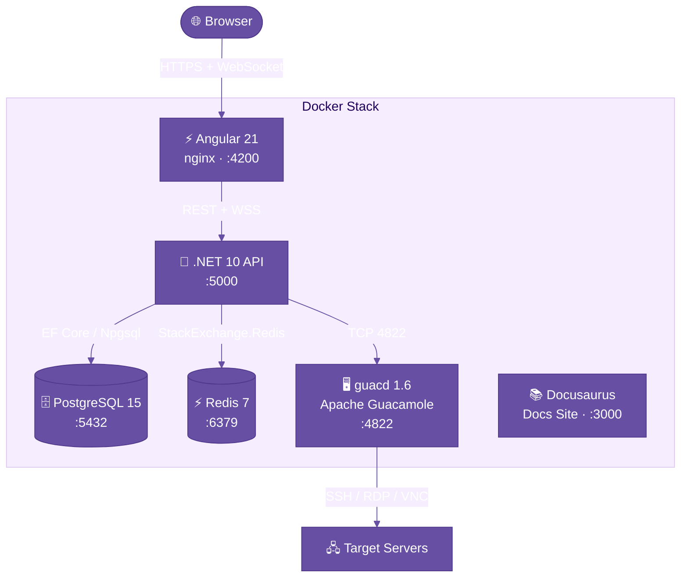
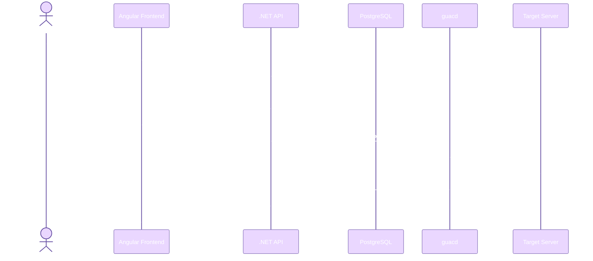
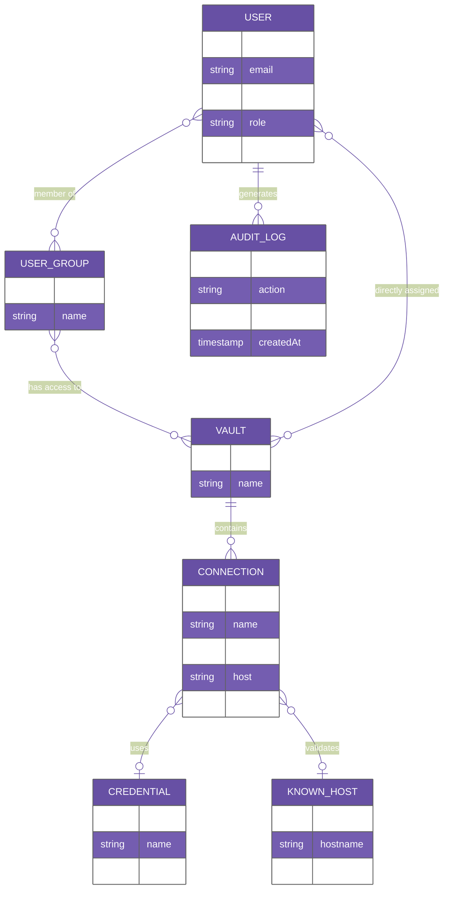

# Smooth Operator 🕶️ 🔐

**Smooth Operator** is a cloud-native, clientless remote access vault. It gives teams secure, browser-based access to SSH, RDP, and VNC servers—without VPN clients, exposed ports, or direct credential sharing.

End users never see actual credentials. Admins control exactly who can access what, through granular role-based permissions and vault assignments.

> 📖 **Full documentation →** [http://localhost:3000](http://localhost:3000) *(start the docs container with `docker-compose up docs`)*

---

## 🏗️ Architecture



### Component Breakdown

| Component | Technology | Role |
|-----------|-----------|------|
| **Frontend** | Angular 21, Tailwind CSS 4, guacamole-common-js | SPA served via nginx; lazy-loaded feature modules, NgRx Signal Stores, runtime config |
| **Backend** | .NET 10, ASP.NET Core, EF Core | Clean Architecture (Domain/Application/Infrastructure/Api); CQRS via MediatR; REST API + WebSocket tunnel |
| **Database** | PostgreSQL 15 | Users, vaults, connections, credentials, groups, audit logs |
| **Cache** | Redis 7 | Rate limiting, session state |
| **Connection Engine** | Apache guacd 1.6 | Translates RDP/SSH/VNC to Guacamole protocol over WebSocket |
| **Docs** | Docusaurus 3 | User guide, admin guide, and API reference |

### Backend Architecture (Clean Architecture + CQRS)

```
backend/
├── src/
│   ├── SmoothOperator.Domain/         # Entities, value objects. Zero dependencies.
│   ├── SmoothOperator.Application/    # MediatR commands/queries/handlers, FluentValidation,
│   │                                  # DTOs, Options classes, ports (interfaces).
│   ├── SmoothOperator.Infrastructure/ # EF Core, Redis, MailKit, encryption, SSO adapters.
│   └── SmoothOperator.Api/            # Thin controllers (single MediatR.Send per action),
│                                      # DI composition root, middleware, Program.cs.
└── tests/
    ├── SmoothOperator.Api.Tests/      # WebApplicationFactory integration tests.
    └── SmoothOperator.ArchitectureTests/ # NetArchTest layer-boundary enforcement.
```

Dependency rule: `Api → Application → Domain`; `Infrastructure → Application, Domain`.

---

## 🔌 Remote Session Flow



---

## 🗄️ Data Model



---

## ✨ Features

### 🔐 Security & Access Control
- **Role-Based Access Control (RBAC)** — four built-in roles: `Owner`, `Admin`, `TeamAdmin`, `User`
- **Vault-based isolation** — users only see connections in vaults they're assigned to, never raw credentials
- **Invite-only registration** — no public self-registration; admins send email invites
- **Rate limiting** — fixed-window limiter on auth endpoints (5 req/min per IP)

### 🔑 Authentication
- **Local auth** — username/password with BCrypt hashing + HS256 JWT
- **SSO via OIDC** — plug in any OpenID Connect provider (Azure AD, Okta, Auth0, …)
- **SSO via SAML 2.0** — enterprise identity federation
- **Forgot-password flow** — email-based password reset (requires SMTP)

### 🖥️ Remote Sessions
- **RDP, SSH, VNC** — all three protocols via Apache Guacamole
- **Browser-native** — zero client software; runs on any modern browser
- **HTML5 Canvas rendering** — full keyboard/mouse capture via `guacamole-common-js`
- **Clipboard sharing** — bidirectional clipboard between browser and remote session
- **SSH key pair generation** — generate and store SSH keys directly in the vault

### 📋 Administration
- **User & group management** — create groups, assign members, bulk-grant vault access
- **Known hosts** — store and verify SSH host fingerprints
- **SMTP configuration** — connect any SMTP server for invite/reset emails; test with one click
- **Audit logs** — complete action history with IP addresses, exportable to CSV
- **Credential vault** — store passwords and SSH keys, encrypted at rest

### 🎨 UX & Design
- **Operator Glass design system** — glassmorphic UI built on Material Design 3 color tokens
- **Light / dark theme** — auto-detects `prefers-color-scheme`; user-toggleable at runtime
- **Fully responsive** — works on desktop and tablets
- See [frontend/DESIGN_SYSTEM.md](frontend/DESIGN_SYSTEM.md) for the full token reference

---

## 🛠️ Tech Stack

| Layer | Technology | Version |
|-------|-----------|---------|
| Frontend framework | Angular | 21 |
| Frontend styling | Tailwind CSS | 4 |
| Remote protocol rendering | guacamole-common-js | 1.6 |
| Backend framework | ASP.NET Core | .NET 10 |
| ORM | Entity Framework Core + Npgsql | 9 |
| Authentication | JWT HS256 + OIDC + SAML 2.0 | — |
| Database | PostgreSQL | 15 |
| Cache / rate limiter | Redis | 7 |
| Connection engine | Apache guacd | 1.6 |
| Email | MailKit | — |
| API docs | Swagger / OpenAPI | — |
| Docs site | Docusaurus | 3 |
| CI/CD | GitHub Actions | — |

---

## 🚀 Quick Start

### Prerequisites
- [Docker Desktop](https://www.docker.com/products/docker-desktop/) (or Docker Engine + Compose)
- Ports `4200`, `5000`, `3000`, `5432`, `6379`, `4822` available

### 1. Clone and start

```bash
git clone https://github.com/alessandrocaetanob/smooth-operator.git
cd smooth-operator
docker-compose up --build
```

| Service | URL |
|---------|-----|
| **App** | http://localhost:4200 |
| **API** | http://localhost:5000 |
| **API Docs (Swagger)** | http://localhost:5000/swagger |
| **Docs site** | http://localhost:3000 |

### 2. First-access setup

Open http://localhost:4200. On first run the app redirects to the **setup wizard** where you create the initial Owner account, set a display name, and (optionally) configure SMTP.

### 3. Invite users

From **Settings → Users**, use the **Invite** button to send invite links to team members.

### 4. Create a vault and a connection

1. **Settings → Vaults** — create a vault (e.g. "Production Linux")
2. **Connections** — add an SSH/RDP/VNC connection, assign it to the vault
3. **Settings → Users** — assign users (or groups) to the vault

### 5. Connect

Users see their assigned connections under **My Access** or **My Vaults** and can launch a live session with one click.

---

## 🔧 Running Services Independently

### Frontend (Angular)
```bash
cd frontend
npm install
npm start
# → http://localhost:4200
```

### Backend (.NET)
```bash
cd backend/src/SmoothOperator.Api
dotnet restore ../../../smooth-operator.sln
dotnet run
# → http://localhost:5000
# → Swagger UI at http://localhost:5000/swagger (Development only)
```

### Docs site (Docusaurus)
```bash
cd docs
npm install
npm start
# → http://localhost:3000
```

---

## ⚙️ Environment Variables

All variables follow the **Options pattern** — nested keys use `__` as separator in environment variables.  
See `.env.example` for a full template with generation hints.

### Required

| Variable | Service | Description |
|----------|---------|-------------|
| `ConnectionStrings__DefaultConnection` | backend | PostgreSQL connection string |
| `ConnectionStrings__Redis` | backend | Redis host:port |
| `Encryption__Key` | backend | 64-char hex (256-bit) — encrypts stored credentials. Generate: `openssl rand -hex 32` |
| `Jwt__Key` | backend | ≥32-byte random secret for HS256 signing. Generate: `openssl rand -hex 32` |

### Optional / Defaults

| Variable | Default | Description |
|----------|---------|-------------|
| `ASPNETCORE_ENVIRONMENT` | `Production` | `Development` enables Swagger UI and detailed errors |
| `Jwt__Issuer` | `smooth-operator` | JWT issuer claim |
| `Jwt__Audience` | `smooth-operator-api` | JWT audience claim |
| `Jwt__AccessTokenExpirationMinutes` | `60` | Access token lifetime |
| `Jwt__RefreshTokenExpirationDays` | `7` | Refresh token lifetime |
| `Guacd__Host` | `guacd` | guacd service hostname |
| `Guacd__Port` | `4822` | guacd TCP port |
| `AppUrls__App` | `http://localhost:4200` | Public app URL (used in email links) |
| `AppUrls__Frontend` | `http://localhost:4200` | Frontend origin for CORS allow-list |
| `AppUrls__AllowedOrigins` | `[]` | Comma-separated extra CORS origins |
| `DataProtection__KeysPath` | `/data/protection-keys` | Where ASP.NET Data Protection writes key ring |
| `Otel__Endpoint` | *(disabled)* | OpenTelemetry OTLP gRPC endpoint |
| `Otel__ServiceName` | `smooth-operator-backend` | Service name in traces/metrics |

### SSO (optional)

| Variable | Description |
|----------|-------------|
| `AzureAd__Instance` | `https://login.microsoftonline.com/` — enables Entra ID SSO |
| `AzureAd__TenantId` | Entra ID tenant GUID |
| `AzureAd__ClientId` | Entra ID app client ID |
| `AzureAd__ClientSecret` | Entra ID client secret |

### SMTP (optional)

| Variable | Description |
|----------|-------------|
| `Smtp__Host` | SMTP server hostname |
| `Smtp__Port` | SMTP port (default `587`) |
| `Smtp__Username` | SMTP username |
| `Smtp__Password` | SMTP password |
| `Smtp__FromAddress` | From address for invite/reset emails |

### Frontend runtime config

| Variable | Default | Description |
|----------|---------|-------------|
| `APP_HELP_URL` | `http://localhost:3000` | Help link in sidebar |
| `APP_DOCS_URL` | `http://localhost:3000` | Docs link in login page |
| `APP_FEATURE_FLAGS` | `{}` | JSON feature-flag map |

> ⚠️ **Security:** The default `Encryption__Key` and `Jwt__Key` in `docker-compose.yml` are placeholders for **development only**. Always supply strong random secrets in non-local environments — via Docker secrets, a secrets manager, or a `.env` file that is **never committed**.


---

## 🔒 CI/CD & Security

GitHub Actions workflows run on every push and PR:

| Workflow | What it checks |
|----------|---------------|
| **CodeQL** | Static analysis for C# and TypeScript vulnerabilities |
| **Dependency scan** | Known CVEs in npm and NuGet packages |
| **Docker scan** | Container image vulnerability scanning |
| **Build validation** | Frontend build + backend compile |
| **Format check** | Prettier (frontend) + dotnet format (backend) |
| **Tests** | Vitest unit tests (frontend) + xUnit integration tests (backend) |
| **Smoke Tests** | Playwright E2E browser automation |

---

## 🧪 Testing

We maintain high code quality with automated test coverage enforcement (80% on Codecov `backend` flag / 70% frontend patch).

### Test Stack
- **Backend:** xUnit + FluentAssertions + WebApplicationFactory integration tests
- **Architecture:** NetArchTest.Rules — enforces Clean Architecture layer boundaries in CI
- **Frontend:** Vitest + Angular Testing Library
- **E2E/Smoke:** Playwright
- **Coverage:** Coverlet (Cobertura) + ReportGenerator

### Running Tests

#### Backend

```bash
# From repo root — runs all 151 tests (142 integration + 9 architecture)
dotnet test smooth-operator.sln
```

#### Backend with Coverage Report

```bash
dotnet test smooth-operator.sln \
  --settings coverlet.runsettings \
  -- DataCollectionRunSettings.DataCollectors.DataCollector.Configuration.Format=cobertura
reportgenerator -reports:"**/coverage.cobertura.xml" -targetdir:coveragereport -reporttypes:Html
```

#### Frontend

```bash
cd frontend
npm test              # watch mode
npm test -- --run     # single-run (CI)
```

### Testing Decisions
1. **Impersonation headers** — integration tests inject `X-Test-UserId` / `X-Test-Roles` headers to simulate any user role without JWT ceremony.
2. **Real EF with SQLite** — integration tests use EF Core + in-memory SQLite for per-test isolation; no mocked repositories.
3. **Architecture tests** — `SmoothOperator.ArchitectureTests` asserts layer dependency rules using NetArchTest so violations fail CI immediately.
4. **Output cache invalidation** — write endpoints evict related cache tags (`EvictByTagAsync`) so subsequent GETs in tests receive fresh data.

📖 Workflow details: [.github/workflows/README.md](.github/workflows/README.md)

---

## 📖 Documentation

Full user guides, admin reference, integration guides, and API documentation are available in the **Smooth Operator Docs** site.

```bash
# Start only the docs container
docker-compose up docs
# → http://localhost:3000
```

| Section | Contents |
|---------|---------|
| [Getting Started](http://localhost:3000/docs/getting-started) | Installation, first setup, prerequisites |
| [User Guide](http://localhost:3000/docs/user-guide) | My Access, active sessions, profile |
| [Admin Guide](http://localhost:3000/docs/admin-guide) | Users, groups, vaults, connections, credentials, SSO, SMTP |
| [API Reference](http://localhost:3000/docs/api-reference) | Interactive Swagger UI + integration examples |
