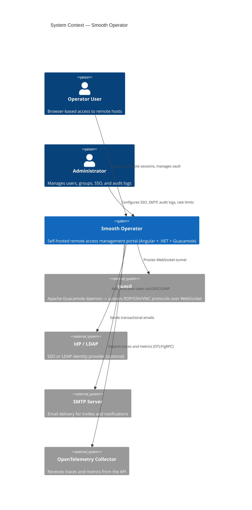
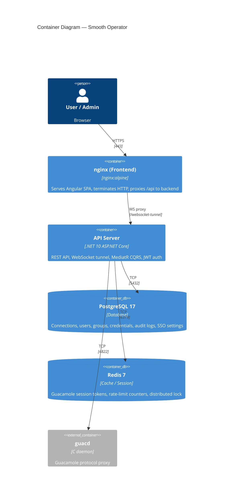
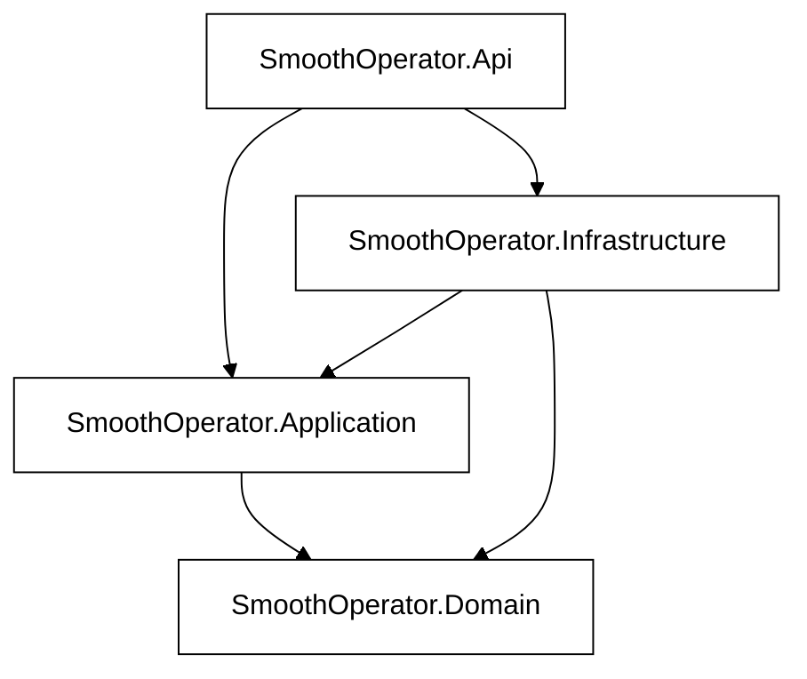
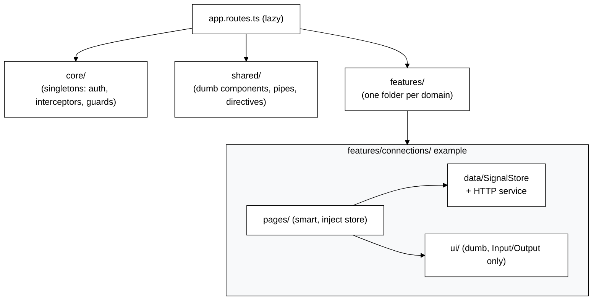
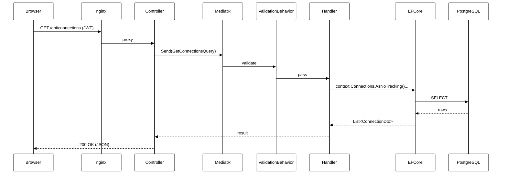

# Architecture Overview

Smooth Operator is a self-hosted remote access management platform. Users authenticate, manage connection credentials, and launch Guacamole-proxied sessions (RDP, SSH, VNC) from a browser — all without exposing ports directly.

---

## C4 Level 1 — System Context



---

## C4 Level 2 — Container Diagram



---

## C4 Level 3 — Backend Component Diagram

```mermaid
%%{init: {
  'theme': 'base',
  'themeVariables': {
    'mainBkg': '#ffffff',
    'c4ShapeFill': '#ffffff',
    'c4ShapeBorderColor': '#000000',
    'c4ShapeTextColor': '#000000',
    'c4LineColor': '#000000',
    'c4BoundaryBorderColor': '#000000',
    'c4BoundaryTextColor': '#000000',
    'fontSize': '16px',
    'fontFamily': 'Inter, system-ui, sans-serif'
  }
}}%%
C4Component
  title Backend Component — SmoothOperator.Api

  Container_Boundary(api, "SmoothOperator.Api (.NET)") {
    Component(controllers, "Controllers", "ASP.NET Controllers", "Thin: validate JWT, call mediator.Send()")
    Component(middleware, "Middleware", "ASP.NET Middleware", "CorrelationId, SecurityHeaders, RateLimiting, ExceptionHandler")
    Component(program, "Program.cs", "Composition Root", "DI registrations, OpenTelemetry, Serilog, Health checks")
  }

  Container_Boundary(app, "SmoothOperator.Application") {
    Component(handlers, "CQRS Handlers", "MediatR IRequestHandler", "All business logic; one handler per command/query")
    Component(validators, "FluentValidation", "AbstractValidator<T>", "Input validation in pipeline before handler runs")
    Component(pipeline, "Pipeline Behaviors", "IPipelineBehavior", "Logging, validation, exception handling")
    Component(ports, "Ports (Interfaces)", "C# Interfaces", "IEncryptionService, IEmailService, IAuditService, ITokenService")
    Component(options, "Options Classes", "IOptions<T>", "JwtOptions, GuacdOptions, SmtpOptions, EncryptionOptions, ...")
  }

  Container_Boundary(infra, "SmoothOperator.Infrastructure") {
    Component(efcore, "AppDbContext", "EF Core 10", "PostgreSQL persistence, migrations, entity configurations")
    Component(redisAdapter, "Redis Adapters", "StackExchange.Redis", "Session token store, rate-limit counters")
    Component(email, "MailKit Adapter", "MailKit", "SMTP email delivery")
    Component(encryption, "Encryption Service", "AES-256-GCM", "Credential encryption/decryption")
    Component(sso, "SSO Adapters", "OpenIddict / LDAP", "OIDC token exchange, LDAP bind")
    Component(guacProxy, "Guacamole Proxy", "TCP↔WebSocket", "Guacamole handshake, session pump, metrics")
  }

  Container_Boundary(domain, "SmoothOperator.Domain") {
    Component(entities, "Entities", "C# Classes", "Connection, User, Group, Credential, AuditLog, ...")
    Component(valueObjects, "Value Objects", "C# Records", "Immutable types with domain validation")
  }

  Rel(controllers, handlers, "mediator.Send()")
  Rel(handlers, ports, "calls interfaces")
  Rel(handlers, entities, "operates on domain objects")
  Rel(infra, ports, "implements")
  Rel(efcore, entities, "persists/reads")
  Rel(guacProxy, redisAdapter, "stores session tokens")
  Rel(middleware, program, "registered by")
```

---

## Backend Layer Dependencies



> Dependency rules are enforced by `SmoothOperator.ArchitectureTests` (NetArchTest) — any violation fails CI.

---

## Frontend Component Architecture



---

## Request Flow (typical API call)


